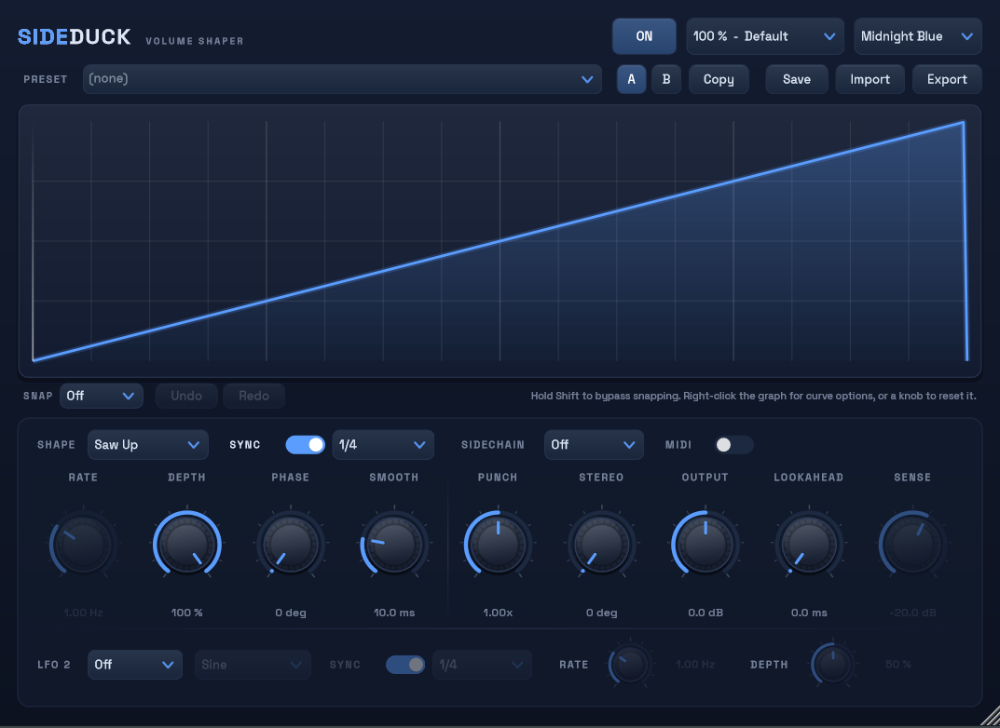

# SideDuck

<p align="center">
  
</p>

An LFOTool-style sidechain / volume-ducking VST3 plugin built with JUCE. The
LFO (or an external sidechain signal, or MIDI notes) modulates the output gain
so you get sidechain "pumping" without routing anything into a compressor —
or, with the sidechain modes, a smarter version of the real thing. A second
LFO can simultaneously sweep a low-pass filter or auto-pan the signal.

- **Formats**: VST3 (Windows x64) + Standalone app
- **Latency**: 0 samples with Lookahead at 0 ms, otherwise equal to the
  Lookahead time (reported to the host, so playback stays aligned)

---

## Installation

1. Copy `SideDuck.vst3` (the whole folder) into one of:
   - `C:\Program Files\Common Files\VST3` (system-wide, needs admin)
   - `%LOCALAPPDATA%\Programs\Common\VST3` (per-user, no admin)
2. In FL Studio: **Options → Manage plugins → Find installed plugins**, then
   star **SideDuck** under Installed → Effects → VST3.
3. Drop it on the mixer insert of whatever should be ducked (bass, pads, a
   bus — not the kick). Close FL Studio (or unload the plugin) before
   overwriting the file with a newer build.

---

## The interface, top to bottom

### Header
| Control | Function |
|---|---|
| **ON/OFF** | Master power. When off, the gain smoothly ramps back to unity — click-free A/B of the effect. Automatable. |
| **Scale dropdown** | Jumps the UI to preset sizes: 80 / 90 / 100 / 110 / 125 / 150 %, each labelled (Compact, Reduced, Default, Comfort, Large, Extra Large). Remembered per project but never changed by loading a preset. |
| **Theme dropdown** | Classic Dark, Midnight Blue, Light, Neon, Graphite, Emerald, or Sunset. Restyles the entire UI live. Stored in the shared SideDuck settings file (`%APPDATA%\SideDuck`), so it applies to every instance and is never touched by presets or projects. |

The window is also **freely resizable**: drag any edge or corner of the
plugin window (or the grip at its bottom-right) and the whole UI scales
smoothly between 50 % and 200 %, keeping its aspect ratio. The size you land
on is saved with the project; the Scale dropdown shows the nearest step.

Every control shows a **tooltip** describing its function when you hover over
it for about a second.

### Preset bar
| Control | Function |
|---|---|
| **Preset dropdown** | Lists every `.sdpreset` in your library (`%APPDATA%\SideDuck\Presets`). Selecting one loads it instantly. The first entry, **Init (Default)**, resets every parameter and the custom curve back to the factory state (the curve reset is undoable). |
| **A / B** | Compare slots. Switching stores the current sound in the slot you leave and recalls the other, so you can flip between two variants of a patch. A slot you have never used inherits the current sound. Session-only — not saved with the project. |
| **Copy** | Copies the current sound into the other compare slot — set up A, copy to B, then tweak B and flip to compare. |
| **Save** | Saves the current state (all knobs + custom curve) into the library. |
| **Import** | Picks a `.sdpreset` from anywhere, copies it into your library, and loads it. |
| **Export** | Saves the current state to any location — for sharing or backup. |

Presets store everything about the sound (including the custom curve) but
deliberately **not** the UI scale.

### LFO display
Live view of one LFO cycle. The blue curve is the **volume** over the cycle
(top = full volume, bottom = silence) with Depth applied; the white dot is
the current playback position. Grid lines mark quarter positions of the
cycle.

The display is also the **custom curve editor** (see below).

### Selector row
| Control | Function |
|---|---|
| **Shape** | LFO shape. All built-in shapes start ducked at phase 0 (the beat) and recover — see the shape list below. |
| **Sync** | On: the LFO locks to FL's tempo and timeline using the division dropdown. Off: free rate in Hz from the Rate knob. The inactive control is greyed out. |
| **Division** | Cycle length when synced: 8 bars, 4 bars, 2 bars, 1 bar, 1/2, 1/4 (default), 1/8, 1/16, 1/32. |
| **Sidechain** | Sidechain mode: Off / Duck / Trigger — see "External sidechain" below. |
| **MIDI** | MIDI note retrigger. Every note the plugin receives restarts the shape as a one-shot: the curve plays through once, then holds at full volume until the next note — see "MIDI retrigger" below. |

### Knobs — row 1
| Knob | Range (default) | Function |
|---|---|---|
| **Rate** | 0.02–50 Hz (1 Hz) | LFO speed when Sync is off. Up to ~50 Hz reaches tremolo territory. |
| **Depth** | 0–100 % (100 %) | How far the volume dips. 100 % ducks to silence at the curve's lowest point. |
| **Phase** | 0–360° (0°) | Shifts the LFO start point within the cycle — nudge the dip earlier or later relative to the beat. The display shifts with it. |
| **Smooth** | 0–200 ms (10 ms) | One-pole smoothing on the gain signal. Removes clicks from hard edges (Square, Pulse, Steps, sharp custom curves). Higher values round off the whole movement. |

### Knobs — row 2
| Knob | Range (default) | Function |
|---|---|---|
| **Punch** | 0.25x–4x (1x) | Exponent applied to the LFO curve. Above 1x the duck digs deeper and holds longer before snapping back (harder pump); below 1x it recovers early and gently. Works on every shape including Custom — one-knob curve redesign, great for automation. |
| **Stereo** | 0–180° (0°) | Phase offset between the left and right channel LFOs. Small values sweep the pump across the stereo field; 180° alternates left/right completely. |
| **Output** | -12 to +12 dB (0 dB) | Output trim / makeup gain, applied last. |
| **Lookahead** | 0–10 ms (0 ms) | The audio is delayed by this amount while LFO/sidechain detection runs on the live signal, and the delay is reported to FL as latency (automatically compensated). The duck therefore starts *before* a transient lands — removes clicks on kick attacks in sidechain modes. 2–3 ms is usually enough. The playhead and gain animation are delayed by the same amount, so the display stays in sync with what you hear. |
| **Sense** | -40 to -6 dB (-20 dB) | Detection threshold for sidechain **Trigger** mode (greyed out otherwise). Lower values fire on quieter transients. Detection re-arms 6 dB below the threshold, so one hit fires exactly one shot. |

**Knob shortcuts**: right-click or double-click any knob to reset it to its
default value.

### LFO 2 row

A second, independent LFO under the knobs. It never touches the volume —
it modulates one of two targets:

| Control | Function |
|---|---|
| **Target** | **Off** (LFO 2 fully disabled), **Filter** (sweeps a 12 dB/oct low-pass down from 20 kHz — up to 7 octaves at full depth), or **Pan** (auto-pan with a balance law: centre stays at unity gain, no loudness jump). |
| **Shape** | Same shape list as the main LFO. **Custom** shares the curve drawn in the main editor. |
| **Sync / Division / Rate** | Same tempo behaviour as the main LFO, with its own division or free rate — run the filter at 2 bars while the duck pumps at 1/4. |
| **Depth** | How far the filter sweeps down, or how wide the pan swings. |

LFO 2 follows the transport like the main LFO but is never frozen by the
sidechain modes. When the transport stops (or the plugin is switched off) it
relaxes smoothly to neutral: filter fully open, pan centred — so it is
click-free and transparent when idle.

---

## Waveforms

All shapes are "volume curves": phase 0 is the beat, value 1 is full volume.

| Shape | Character |
|---|---|
| **Sine** | Smooth symmetric dip-and-recover. Gentle, musical pumping. |
| **Triangle** | Linear dip-and-recover. Slightly firmer than sine. |
| **Saw Up** *(default)* | Instant duck on the beat, straight linear recovery — the classic pump. |
| **Saw Down** | Full volume on the beat, fades out toward the next — reverse pump / fade effect. |
| **Square** | Hard gate: silent first half, full second half. Use Smooth to tame clicks. |
| **Custom** | Your own breakpoint curve — see next section. |
| **Exp Pump** | Instant duck, exponential recovery like a real compressor release. The most "analog"-sounding pump. |
| **Pulse** | Hard duck for only the first 25 % of the cycle, then full volume — short surgical dip. |
| **Steps** | Four-step staircase recovery — rhythmic gated build within each cycle. |

---

## Custom curve editor

Select **Custom** in the Shape menu, or just click the display: if a built-in
shape is selected, the click **converts that shape into editable breakpoints**
— editing always starts from exactly what you see (and the conversion is
undoable, so Ctrl+Z brings your previous custom curve back). Then:

- **Click empty space** — adds a breakpoint and immediately drags it.
- **Drag a point** — moves it. Points can't cross each other. The cursor
  becomes a pointing hand over a grabbable element.
- **Drag a diamond handle** (segment midpoint) — bends the segment into a
  curve; the midpoint follows your mouse. Double-click or right-click the
  diamond to straighten the segment again.
- **Double-click or right-click a point** — removes it (at least one point
  always remains).
- **Snap** (dropdown under the display) — Off, 1/32, 1/16, 1/8 or 1/4 of the
  cycle. Point positions snap to the grid; **hold Shift to bypass** snapping
  temporarily. The background grid follows the selected resolution.
- **Right-click empty space** — curve menu: Copy curve, Paste curve (works
  across plugin instances via the clipboard), Reverse, Flip vertical,
  Normalize, Reset curve.
- **Undo/Redo** — buttons under the display, or Ctrl+Z / Ctrl+Y
  (Ctrl+Shift+Z). Covers point adds, deletes, moves, bends and menu
  operations.

Points connect with straight or bent segments and the curve **wraps around**
the cycle boundary — the segment after your last point flows into your first
point, so loops are seamless unless you place a hard jump on purpose.

Editing happens in raw curve space. If Depth is below 100 % you'll see a
dashed guide through your actual points while the main curve shows the
audible result with Depth applied.

The curve (including segment bends) is saved with the FL project and with
presets; presets from older versions load as straight-line curves.

---

## External sidechain

SideDuck has a sidechain input bus. Routing in FL Studio:

1. Select the source mixer track (e.g. the kick).
2. Right-click the **target** track (the one with SideDuck) and choose
   **Sidechain to this track**.
3. Open SideDuck's wrapper → cog icon → **Processing** tab → connections, and
   set the sidechain input to that source.

Then pick a mode in the **SC** dropdown:

| Mode | Behaviour |
|---|---|
| **Off** | Pure LFO operation; the sidechain input is ignored. |
| **Duck** | The gain follows the sidechain signal's envelope (1 ms attack, 120 ms release) — like a real sidechain compressor. Depth sets the maximum reduction; Smooth still applies. The internal LFO is fully frozen, and the display switches to a **live scrolling trace of the actual gain reduction** with a dB readout. Works even when the kick is off-grid, since it's audio-driven. |
| **Trigger** | Transients on the sidechain **restart the LFO shape as a one-shot** — your curve (including Custom) plays through once per hit, then holds at full volume until the next transient. Rate/division set how fast the shape plays out. The playhead mirrors this exactly: it jumps to the start on each hit and parks at the end between hits. Detection fires at the **Sense** threshold (default -20 dBFS) and re-arms 6 dB below it. |

If a sidechain mode is selected but nothing is routed, SideDuck falls back to
normal LFO behaviour.

Use **Look** (lookahead) with either mode to duck slightly ahead of the
transient and keep kick attacks clean.

---

## MIDI retrigger

Turn on the **MIDI** toggle in the selector row and every MIDI note the
plugin receives restarts the shape as a one-shot — exactly like sidechain
Trigger mode, but driven by notes instead of audio, and sample-accurate to
the note position. Use it to place ducks precisely from a ghost pattern, or
to "play" the pump live from a keyboard.

Routing in FL Studio: give SideDuck's wrapper a **MIDI input port**
(wrapper cog → Settings), then set the same port number on the MIDI Out
channel (or your controller) that should drive it.

MIDI and sidechain Trigger can be active at the same time — either source
restarts the shape. With MIDI retrigger on and no notes arriving, the plugin
sits at full volume.

---

## Transport behaviour

- **Playing**: with Sync on, the LFO locks to FL's song position (always
  on-grid, no drift).
- **Paused/stopped**: the LFO freezes and the gain relaxes to full volume, so
  previewing sounds while stopped isn't stuck at a ducked level.
- **Trigger / MIDI retrigger modes**: the LFO runs regardless of transport,
  since the sidechain audio (or incoming notes) drives it.
- **Standalone app**: no host transport exists, so the LFO free-runs
  (at 120 BPM equivalent when synced) — handy for quick testing.

FL-specific note: leave "Use fixed size buffers" off in the wrapper (default),
otherwise tempo sync info arrives late.

---

## Factory presets

Created automatically in `%APPDATA%\SideDuck\Presets` the first time the
plugin loads (existing files are never overwritten — edit or delete freely):

| Preset | Shows off |
|---|---|
| **Classic Pump** | Saw Up, 1/4, extra Punch — the standard sidechain sound. |
| **Analog Pump (Exp)** | Exp Pump shape — compressor-style release curve. |
| **Deep House Sine** | Softer sine pump, 85 % depth, heavy smoothing. |
| **Trance Gate 16ths** | Square wave at 1/16 — rhythmic gating. |
| **Stereo Wobble 8ths** | Triangle at 1/8 with 90° stereo offset — pump that moves across the field. |
| **Stair Gate** | Steps shape over 1/2 — staircase build each half bar. |
| **4-Bar Riser** | Saw Up over 4 bars with high Punch — long tension riser. |
| **Tremolo 8 Hz** | Free-running sine at 8 Hz — classic tremolo. |
| **Double Pump (Custom)** | Custom breakpoint curve with two ducks per cycle — demos the curve editor. |
| **SC Kick Duck** | Sidechain Duck mode + lookahead. Route a kick to the sidechain input. |
| **SC Kick Retrigger** | Sidechain Trigger mode + Exp Pump. Each kick hit restarts the pump shape. |
| **Smooth Operator** | Custom curve with a bent (tension) segment — fast, smooth recovery. |
| **Bounce Groove** | Custom curve with a double bounce, using segment tension both ways. |
| **Half-Time Sway** | Slow sine over half a bar at 60% depth — gentle motion for pads. |
| **Gated Quads (Stereo)** | Square gate with 180° stereo offset — hard left/right alternation. |
| **8-Bar Fade Out** | Saw Down across 8 bars — long transition fade. |
| **Tight Chop 1-32** | 1/32 square chops at 90% depth — stutter effect. |
| **Pump + Filter Sweep** | Classic pump plus LFO 2 sweeping the low-pass over 1 bar — duck and filter motion together. |
| **Auto-Pan 8ths** | Ducking depth at 0, LFO 2 panning on 1/8 — a pure auto-panner. |

---

## Project structure

```
sideduck/                     # repo root
├── CMakeLists.txt            # CMake + JUCE (fetched automatically)
├── README.md                 # this file
├── docs/adr/                 # architecture decision records
├── Assets/                   # embedded UI font (Space Grotesk, SIL OFL)
└── Source/
    ├── LFO.h                 # stateless waveform evaluation (volume curves)
    ├── CustomCurve.h         # baked custom-curve table (lock-free, audio thread)
    ├── Theme.h               # colour themes + shared settings persistence
    ├── SideDuckLookAndFeel.* # custom knob/button/combo/toggle rendering + font
    ├── PluginProcessor.*     # parameters, tempo sync, sidechain, MIDI trigger,
    │                         # LFO2 filter/pan, lookahead, gain processing,
    │                         # curve undo, A/B slots, state, presets
    └── PluginEditor.*        # UI: breakpoint/bezier editor, presets, themes,
                              # snap, undo/redo, UI scaling / free resize
```

## Building

Requires Visual Studio Build Tools (C++ workload). From a VS developer prompt:

```
cmake -G Ninja -B build -DCMAKE_BUILD_TYPE=Release .
cmake --build build
```

Outputs:

- VST3: `build/SideDuck_artefacts/Release/VST3/SideDuck.vst3`
- Standalone: `build/SideDuck_artefacts/Release/Standalone/SideDuck.exe`

## Ideas / roadmap

Shipped in 0.2.0: trigger sensitivity knob (Sense), MIDI note retrigger,
second LFO targeting filter cutoff / pan, A/B compare slots, embedded UI
font, freely resizable window.

Next up:

- Separate custom curve for LFO 2
- High-pass / band-pass modes for the LFO 2 filter
- Persist A/B slots in the project file
- MIDI velocity scaling the one-shot depth
- Preset browser with tags and search
